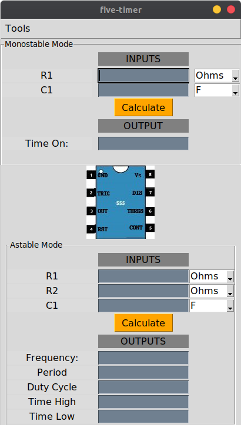

# five-timer 


## Introduction
**five-timer** is a GUI tool that helps you calculate the output values from the NE555 timer IC for both the monostable and astable modes. It also provides you with
estimation graph for easier and quick estimation of resistor values needed.  

## Installing
To install five-timer you will need to have installed python 3.4 or higher. Python can be installed from
[here](https://www.python.org/downloads/). You can then install five-timer on the command line using the following line:
```bash
pip install five-timer
```
## Launching
After installation, five-timer can be launched from the command line using the following command
```bash
five-timer
```

The tool will open as shown below:


## Usage
**Monostable Mode**  
To get the **Time on**, enter the desired capacitor and resistor value, choosing their ranges using the 
drop-down select button next to the entry box. Click **Calculate** button and the **Time on** is displayed in seconds units.

**Astable mode**  
Similarly, the output parameters using the NE-555 timer IC can be calculated using the same method:  
1. Enter the value of R1, R2 and C1 while choosing their range of values  
2. Click the **Calculate** button  

The output values will be displayed.

**Estimation graph**:chart_with_downwards_trend:  
1. Click on **Tools** menu on the menubar
2. Click on the **Estimation graph**

A new TopLevel window opens displaying the Estimation graph.

For more information on the NI-555 timer IC, you can download its datasheet [here](https://components101.com/ics/555-timer-ic-pinout-datasheet)
